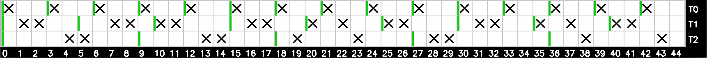

# Scheduling Simulator
This project is part of my lecture Real-time Systems. It implements demos for different scheduling algorithms.

This project is (and probably will be forever) work in progress.

## Build
Requirements: cmake, opencv, gcc

Run `cmake .` followed by `make`. After that the sim can be run by calling the build artifact, eg `./scheduling_sim`.

## Currently implemented Schedulers
This list might be incomplete in the future. See commits or main.cpp for a complete list.

### RMS - Rate Monotonic Scheduling


Example console dump with output and input (marked with "> ")
```
Select scheduler
1) Round Robin
2) RMS
> 2
Enter tasks in following format: start,duration,interval,deadline (comma separated, no space)
empty line if finished
> 0,2,5,5
> 3,3,6,6
> 5,1,10,10
> 
priorityList: 
0 - 1/5
1 - 1/6
2 - 1/10
0 gets this timeslot
pid: 0 Time remaining: 1 Time needed: 2
pid: 1 Time remaining: 0 Time needed: 3
pid: 2 Time remaining: 0 Time needed: 1
-----------------
0 gets this timeslot
pid: 0 Time remaining: 0 Time needed: 2
pid: 1 Time remaining: 0 Time needed: 3
pid: 2 Time remaining: 0 Time needed: 1
-----------------
currently nothing to do
pid: 0 Time remaining: 0 Time needed: 2
pid: 1 Time remaining: 0 Time needed: 3
pid: 2 Time remaining: 0 Time needed: 1
...
```

### Round Robin

```
Enter tasks in following format: duration
empty line if finished
> 0,2
> 0,6
> 0,6
> 0,6
> 0,4
> 
pid: 0 Time computed: 1 Time needed: 2
pid: 1 Time computed: 0 Time needed: 6
pid: 2 Time computed: 0 Time needed: 6
pid: 3 Time computed: 0 Time needed: 6
pid: 4 Time computed: 0 Time needed: 4
-----------------
...
pid: 0 Time computed: 2 Time needed: 2
pid: 1 Time computed: 1 Time needed: 6
pid: 2 Time computed: 1 Time needed: 6
pid: 3 Time computed: 1 Time needed: 6
pid: 4 Time computed: 1 Time needed: 4
0 finished
...
```

### EDS - Earliest Deadline First


### LLF - Least Laxity First

```
Select scheduler
1) Round Robin
2) RMS - Rate Monotonic Scheduling 
3) EDS - Earliest Deadline First
4) LLF - Least Laxity First
4
Enter tasks in following format: start,duration,interval,deadline (comma separated, no space)
empty line if finished
If you dont enter any data (press return without entering data) some example data will be used
Omitted values will have default values. Eg for Round Robin it would be enough to enter the first two values 'start,duration'
> 0,1,3,3
> 0,2,5,5
> 0,2,9,9
> 
at least 45 steps are required, 0 is the last starting process + 45 steps after all processes started
```